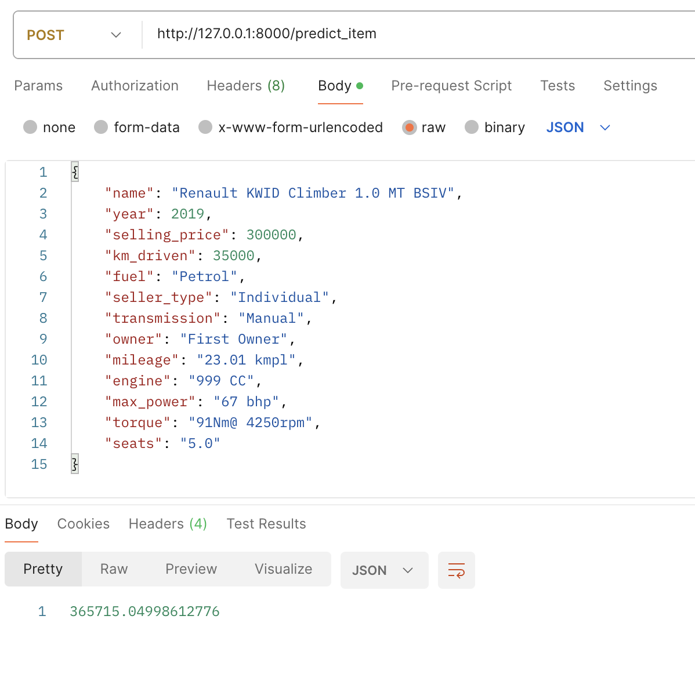

## Было сделано

1. Базовая EDA.
2. Визуализация данных и их анализ.
3. Построен дашборд ydata_profiling (report.html).
4. Данные очищены.
5. Построены модели на различных комбирациях признаков:
   - Простая линейная
   - Со стандартизацией признаков
   - С регуляризацией
   - С кросс-валидацией
   - С OneHot-кодированием для категориальных признаков
   - Ridge-регрессия
6. Использована бизнесовая метрика для всех использованных моделей.
7. Написан сервис с http api для инференса полученных результатов.

## Результаты
Приведены в ноутбуке. Лучшая бизнес-метрика - 66% предсказанных результатов отличаются от реальных не более, чем на 10%. И это Ridge-регрессия c полным набором обработанных признаков.

## Сервис
Код приведен в main.py.

Запуск командой
```
uvicorn main:app --reload
```

Для получения одного результата:
```
curl -X 'POST' 'http://127.0.0.1:8000/predict_item' \
--header 'Content-Type: application/json' \
--data-raw '{
    "name": "Renault KWID Climber 1.0 MT BSIV",
    "year": 2019,
    "selling_price": 300000,
    "km_driven": 35000,
    "fuel": "Petrol",
    "seller_type": "Individual",
    "transmission": "Manual",
    "owner": "First Owner",
    "mileage": "23.01 kmpl",
    "engine": "999 CC",
    "max_power": "67 bhp",
    "torque": "91Nm@ 4250rpm",
    "seats": "5.0"
}'
```
Ответ:
```
365715.04998612776
```

Скрин:
<p align="center">
  
</p>

Для обработки файла:
```
curl -X 'POST' \
        'http://127.0.0.1:8000/predict_items' \
        -H 'accept: text/csv' \
           -H 'Content-Type: multipart/form-data' \
              -F 'file=@cars_test.csv' \
                 --output processed_file.csv
```
Пример строки из файла запроса:
```
name,year,selling_price,km_driven,fuel,seller_type,transmission,owner,mileage,engine,max_power,torque,seats
Mahindra Xylo E4 BS IV,2010,229999,168000,Diesel,Individual,Manual,First Owner,14.0 kmpl,2498 CC,112 bhp,260 Nm at 1800-2200 rpm,7.0
```
Пример строки из файла результата:
```
name,year,selling_price,km_driven,fuel,seller_type,transmission,owner,mileage,engine,max_power,torque,seats,predict
Mahindra Xylo E4 BS IV,2010,229999,168000,Diesel,Individual,Manual,First Owner,14.0 kmpl,2498 CC,112 bhp,260 Nm at 1800-2200 rpm,7.0,281232.950318519
```

Файлы `cars_test.csv` и `processed_file.csv` приложены.


## Кот
Похож на кота моих соседей. Копается в покетах, оставленных курьером у двери.
